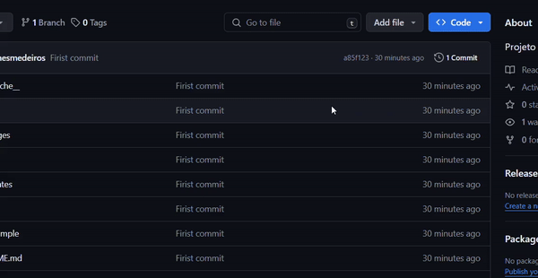

# CineSertão
O projeto CineSertão visa criar uma aplicação para um cinema, facilitando a vida tanto dos usuários quanto dos administradores do site.

## Instalação

Para instalar o projeto, utilize o [git](https://www.git-scm.com/downloads) para cloná-lo, ou clique no botão conforme a imagem abaixo.

```bash
git clone https://github.com/diogenesmedeiros/cineSertao.git
```

Caso não for clonar o repositorio pelo git, clique no botão onde mostra o exemplo abaixo.


## Configurações

Primeiro, recomendo que você crie um arquivo .env para o projeto. No projeto, já existe o ```.env.sample``` para você se basear, mas abaixo está a estrutura de como deve ser o arquivo ```.env```.

```bash
NAME_APP=Cine Sertão

SMTP_SERVER=smtp.gmail.com
PORT=465
EMAIL=seu email do google
PASSWORD=Senhas de app
```
Nota: O campo PASSWORD refere-se às senhas de app do Google, que são utilizadas para acessar aplicativos não seguros. Para obter essa senha, é necessário que a autenticação em dois fatores esteja ativada. Siga [este link](https://myaccount.google.com/apppasswords) para gerar a senha de app.

## Iniciar projeto
Para iniciar o projeto é bem simples. No terminal, navegue até a pasta do projeto e digite o seguinte comando:

```bash
py server.py
```
Ou, se estiver usando alguma IDE, apenas inicie o arquivo ```server.py``` utilizando o botão de execução de código da sua IDE. Feito tudo isso, o site estará rodando. Basta colocar o IP da sua máquina ou localhost e a porta 5000 no seu navegador:

```http://seu_ip:5000``` ou ```http://localhost:5000```

Nota: Pelo IP da máquina, todos os outros dispositivos como celulares, outros computadores, e mais podem acessar o site a partir do IP da máquina na porta 5000.

## Finalização
E é isso! Agora você pode aproveitar sua aplicação de cinema! 😁